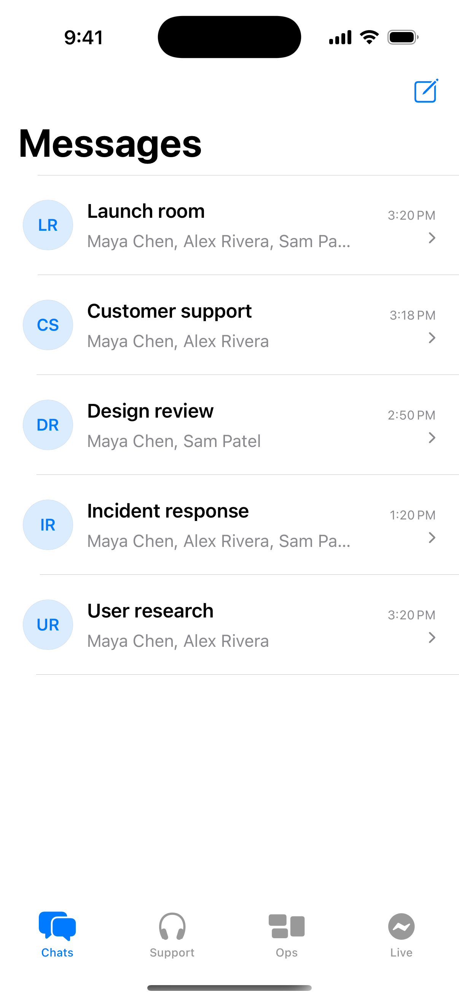
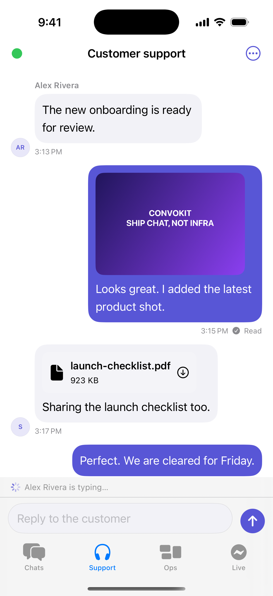
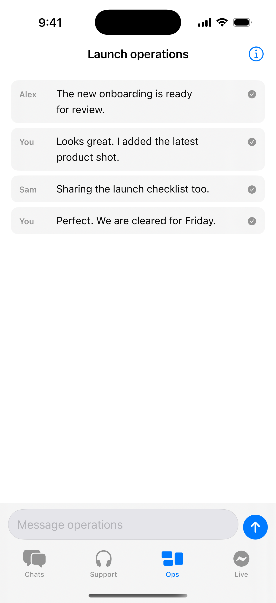

# ConvoKit SwiftUI examples

A public iOS example app for the compiled `ConvoKit` and `ConvoKitUI` Swift package products. The SDK implementation remains private.

The app uses a native iOS tab bar and navigation stacks for four examples:

- **Chats** shows `ConversationListView` as a standard Messages-style inbox and pushes a native conversation screen.
- **Support** demonstrates brand tinting without replacing the navigation bar or system controls.
- **Ops** demonstrates dense, host-rendered message rows inside a normal iOS conversation screen.
- **Live** joins an authorized room through the demo backend and opens the SDK-backed realtime component.

## Run

Open `ConvoKitSwiftExample.xcodeproj` in Xcode and run the `ConvoKitSwiftExample` scheme on an iOS 15+ simulator.

The live example sends the public client ID to `https://convokit-open-chatroom.vercel.app`. The client secret is not present in this repository or the app binary; the backend owns token issuance and room membership policy.
